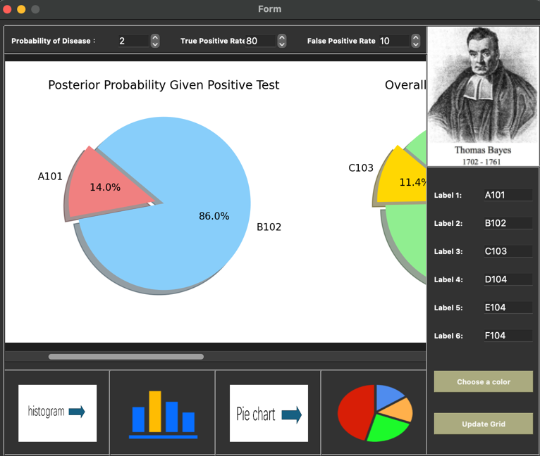

## Project name: Bayesian data visualisation tool
## Introduction

This project is a Bayesian data visualisation application based on PyQt5 and matplotlib, which aims to show visual representation of different statistical data through a graphical interface. Users can adjust the parameters, such as probability, sensitivity, specificity, etc., to view different data visualisation charts, including pie charts, histograms, grid charts and so on.

## Visual Meaning

### Bayesian Pie Chart
Pie charts show the proportionality of data through different coloured sectors, with the size of each sector representing the proportion of that category in the overall population. In a Bayesian context, pie charts are used to visualise probability distributions under given conditions, for example:

P(D+|T+): the posterior probability of actually having the disease in the event of a positive test result.
P(D-|T+): the posterior probability of actually not having the disease when the test result is positive.
P(T+) and P(T-): the overall probability of having a positive or negative test result.
P(D+|T-) and P(D-|T-): the posterior probability of actually having the disease or not having the disease when the test result is negative.
The pie charts allow us to see at a glance the relative proportions of the different outcomes and thus better understand the accuracy of the test and the potential risk of misdiagnosis.

### Bayesian Histogram
A histogram shows the number or frequency of different categories by the height of the rectangular bars, and is a type of chart that shows the distribution. In your code, the histogram is used to show:

Expected number of people: a distribution of the number of people expected to be in a given condition, calculated based on a given probability parameter. This includes the expected value of the number of people who are sick or not sick given a particular test result.
Gender-specific posterior probabilities: shows the distribution of the probability of illness for males and females for a given test outcome, reflecting how gender affects the outcome of the probability calculation.
Histograms enable users to visualise the numerical results of probability calculations, as well as quantitative comparisons of expected outcomes under different conditions, providing a deeper understanding of the statistical principles and practical implications behind test results.


## Features

Multiple Chart Support: Support to generate pie charts, histograms, suitable for different data presentation needs.
Interactive interface: Users can easily set various parameters through the graphical interface and view chart updates instantly.
Data Calculation: Built-in Bayesian probability calculation function automatically calculates the posterior probability based on the input parameters such as prior probability, true positive rate, false positive rate, etc.
## Usage

Start the application: Run the script to start the graphical user interface.
Parameter Setting: Input parameters such as a priori probability, true positive rate, false positive rate, etc. in the interface.
Select Chart Type: Click the corresponding button to select the type of chart you want to generate.
View Result: After the setup is completed, the chart will be automatically updated and displayed on the interface.
## Development Environment

Python version: 3.6 and above
Main dependent libraries: PyQt5, numpy, matplotlib
Installation Guide

Install Python (version 3.6 and above).
Clone or download the code of this project locally.
Install dependent libraries: run pip install matplotlib numpy PyQt5 on the command line to install the required dependencies.
```shell
 pip install matplotlib numpy PyQt5
```
Run main.py to start the application.
```shell
python main.py
```

Precautions

Make sure you have installed all the dependent libraries, especially PyQt5 and matplotlib, which are the basis for running this project.